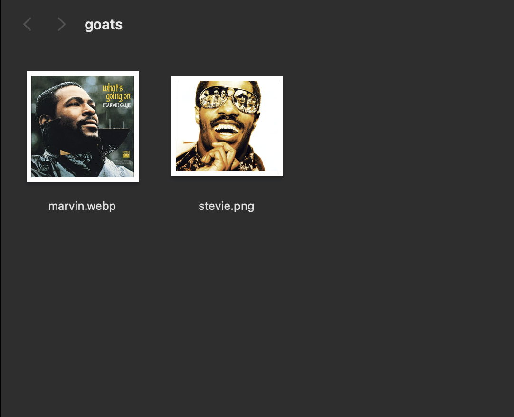
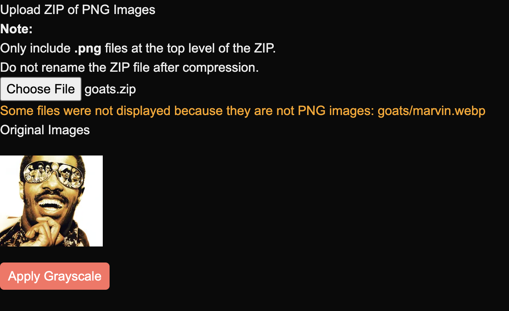
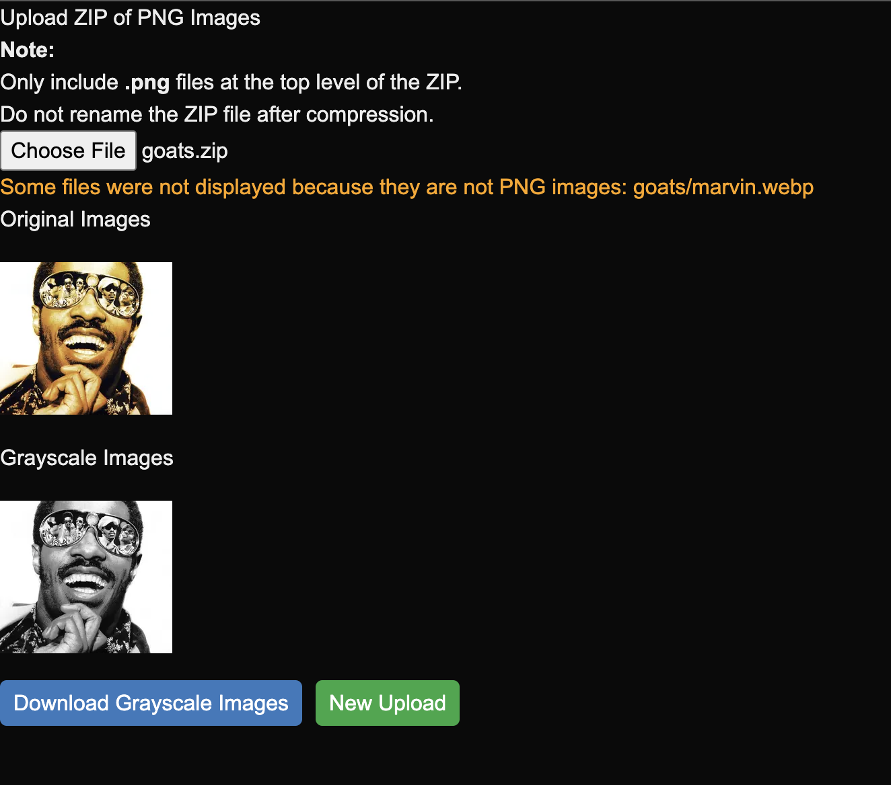

# Image Processor

A web application that processes `.zip` files containing `.png` images. Once uploaded, the images are extracted, converted to grayscale using low-level image processing using stream and pixel manipulation, and displayed for review. Processed images can be downloaded as a ZIP file.

## Features

- Upload `.zip` files containing `.png` images  
- Preview original and grayscale images  
- Download processed grayscale images in a ZIP file  

## Demo

### 1. Uploaded `.zip` Content (Before Compression)  
_The folder before compression should only contain `.png` files. Other formats like `.webp` will be ignored._  



### 2. Uploaded and Extracted Images Preview  
_After uploading, valid `.png` images are displayed._  



### 3. Grayscale Conversion and Download  
_Once processed, grayscale images appear with a download option._  



## Installation

1. Clone the repository:
   ```bash
   git clone https://github.com/your-username/image-processor.git
   cd image-processor
   ```

2. Install dependencies:
   ```bash
   npm install
   ```

3. Run the development server:
   ```bash
   npm run dev
   ```

4. Open [http://localhost:3000](http://localhost:3000) in your browser.

## Scripts

- `npm run dev` — Start development server  
- `npm run build` — Build for production  
- `npm run start` — Start production server  
- `npm run lint` — Run linter  

## Dependencies

- [Next.js](https://nextjs.org/)  
- [React](https://react.dev/)  
- [ADM-ZIP](https://www.npmjs.com/package/adm-zip) — For extracting `.zip` files  
- [pngjs](https://www.npmjs.com/package/pngjs) — For pixel-level PNG processing  

## Dev Dependencies

- TypeScript  
- Tailwind CSS  
- ESLint  

## Future Improvements

- **AWS S3** for secure image storage and scalability  
- **AWS Lambda** for automating image processing workflows  
- Enhanced support for more image formats  